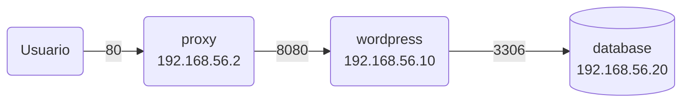
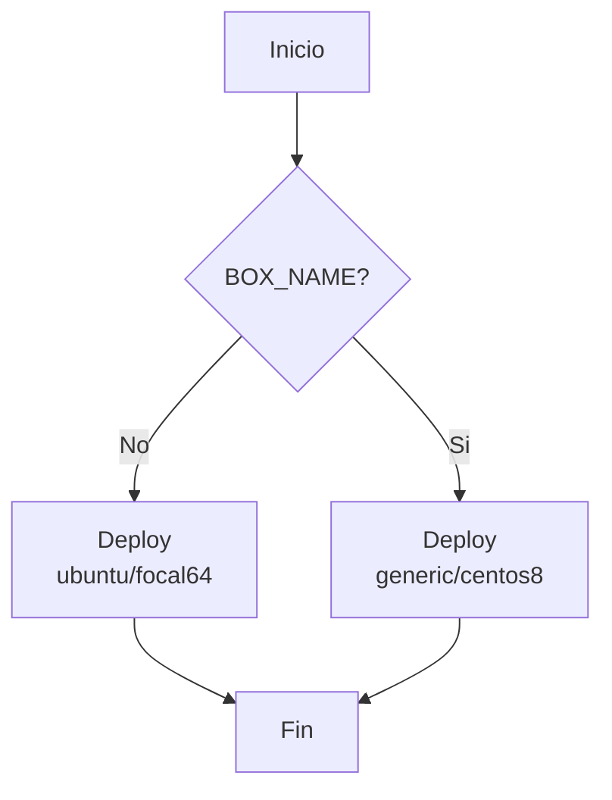

# Despliegue de Wordpress usando Vagrant y Ansible

- Master 

Este proyecto es para una tarea de la Maestría en Desarrollo y Operaciones de UNIR.

El Objetivo es desplegar Wondpress usando Vagrant y Ansible.

## Supuestos

- Se espera que la red de las VMs sea 192.168.56.0/24. Si VirtualBox tiene otro rango de red entonces hay que ajustar el archivio `.env` con los valores adecuados.

## Pre-requisitos

- Necesitas tener instalado Git
- Necesitas tener instalado Vagrant 2.3.7 o superior
- Necesitas tener instalado VirtualBox 7.0 o superior

Instala el plugin `vagrant-env` para poder cargar variables de ambiente desde el archivo `.env`

```bash
workdir> vagrant plugin install vagrant-env
```

## Arquitectura

El proyecto se compone de tres servicios, cada uno deployado en una VM individual:

- database: En esta VM se instala MySQL.
- wordpress: En esta VM se instala el servidor web Apache y la aplicación Wordpress es instalada para ser servida por el servidor web.
- proxy: En esta VM se instala un proxy Nginx el cual será el punto de entrada a la aplicación.

En el siguiente diagrama se pueden ver cómo se relacionan las VMs y los puertos de comunicación que usa cada una de ellas:



## Configuraciones

En el archivo `.env` se pueden definirlas IPs de las máquinas virtuales, esta configuración será usada por Vagrant al momento de desplegar las VMs. Si se hace un cambio en las IPs definidas en el archivo `.env`, entonces ese mismo ajusto hay que hacerlo en el archivo de inventario de ansible `inventory`, el cual se encuentra al mismo nivel que el archivo `.env` en el repositorio.

También podemos definir qué caja o sistema operativo usar para las VMs. Este proyecto fue creado para poder desplegar las VMs usando Ubuntu y CentOS. Mira el siguiente diagrama:



Entonces, si la variable de ambiente `BOX_NAME` no existe por default se usará `ubuntu/focal64` como sistema operativo para las VMs. En la sección [Uso](#uso) se explica más a detalle cómo usar esta configuración.

## Uso

Cómo se explicó en la sección anterior, la variable de ambiente `BOX_NAME` determina qué SO usar en las VMs. Si esta variable de ambiente no está definida entonces por default se usará `ubuntu/focal64` la cual es un Ubuntu 20.04. Así que para desplegar las VMs de forma sencilla basta con ejecutar el siguiente comando:

```bash
workdir> vagrant up
```

Para levantar las máquinas virtuales usando CentOS 8 como sistema operativo ejecutamos el comando:

```bash
workdir> BOX_NAME="generic/centos8" vagrant up
```

También podemos mezclar las versiones, por ejemplo, podemos desplegar la base de datos usando CentOS y Wordpress usando Ubuntu:

```bash
workdir> BOX_NAME="generic/centos8" vagrant up database
workdir> vagrant up wordpress
```

O la base de datos y Wordpress en Ubuntu y el proxy en CentOS:

```bash
workdir> vagrant up database
workdir> vagrant up wordpress
workdir> BOX_NAME="generic/centos8" vagrant up proxy
```

## Acceder a Wordpress

Una vez que se hayan levantado todas las VMs podrás acceder a Wordpress en la página: http://192.168.56.2/

## Demo del despliegue

El siguiente video muestra el despliegue completo de las VMs:

[](https://asciinema.org/a/6W0M6dJut80fWpPEXVhNnOtaJ)

## Cómo se hizo

En el documento [HOWTO](HOWTO.md) podrás encontrar una explicación más amplia y detallada de los pasos que se siguieron para el desarrollo de este proyecto.

## Conclusiones

En el proyecto descrito se detalla el proceso de creación de un entorno de desarrollo utilizando Ansible y Vagrant para implementar una infraestructura que incluye una base de datos MySQL, un servidor web Apache con la instalación de Wordpress, y un proxy usando Nginx. El enfoque modular y bien organizado del proyecto permite una fácil configuración y personalización de las máquinas virtuales en función de las preferencias del sistema operativo (Ubuntu o CentOS).

El uso de variables de entorno, archivos de inventario y estructuras de directorios bien definidas contribuye a una implementación flexible y reutilizable. La modularización de las tareas en roles y playbooks hace que la administración y el mantenimiento sean más eficientes. Además, la integración de roles específicos para cada sistema operativo garantiza una instalación coherente y adaptada a las diferencias entre plataformas. El proyecto también destaca la importancia de la seguridad y la configuración adecuada, como la apertura de puertos en el firewall y la gestión de permisos en SELinux.

En resumen, este proyecto demuestra cómo utilizar Ansible y Vagrant para automatizar la creación y configuración de una infraestructura de desarrollo completa con varias máquinas virtuales. La organización modular y la consideración de las diferencias entre sistemas operativos hacen que el proyecto sea escalable y adaptable, permitiendo a los desarrolladores crear entornos personalizados de manera eficiente y reproducible.

## Referencias

Ansible playbooks — Ansible Documentation. (2023). Ansible.com. <https://docs.ansible.com/ansible/latest/playbook_guide/playbooks_intro.html>

‌
Ansible - Provisioning | Vagrant | HashiCorp Developer. (2023). Ansible - Provisioning | Vagrant | HashiCorp Developer. <https://developer.hashicorp.com/vagrant/docs/provisioning/ansible>

‌
WP-CLI | WP-CLI. (2021). Wp-Cli.org. <https://wp-cli.org/>

## Créditos

Si este proyecto te resulta de utilidad, puedes usarlo, pero siempre recuerda dar los cŕeditos apropiados al autor [Carlos E Colón R](mailto:espacio.sideral@gmail.com)
